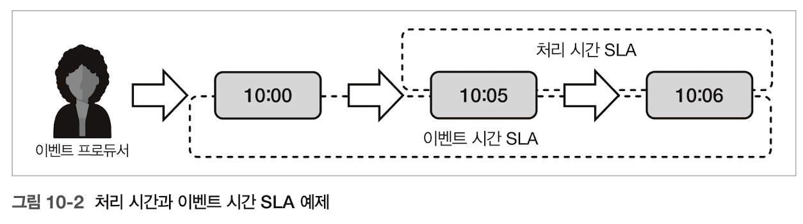
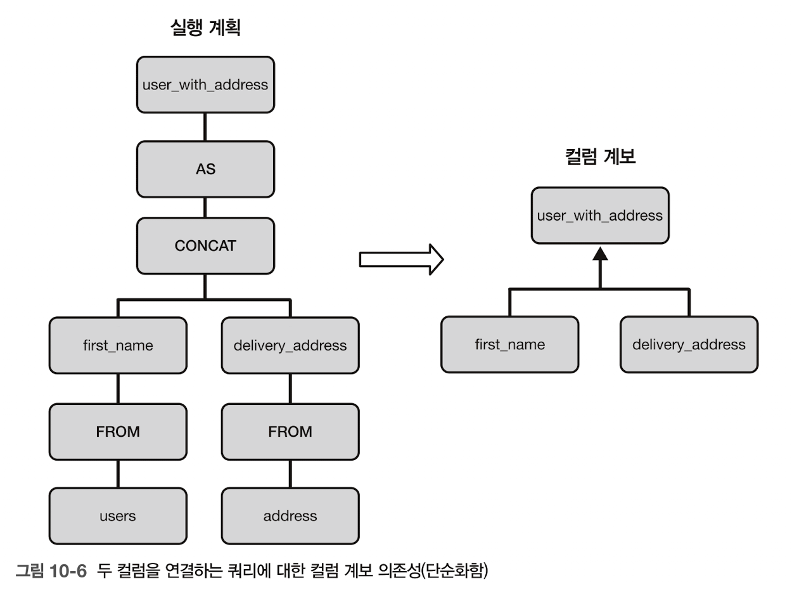

# Ch10. Data Observability Design Patterns

# Concept

- 탐지: 데이터나 시간과 관련된 모든 문제 발견 ⇒ 배치 잡이 완료되는데 너무 많은 시간이 걸릴때마다 **알림**을 받는데 유용
- 추적: 데이터셋/컬럼/데이터처리 계층 간의 관계 이해 ⇒ 개별 컬럼에 대한 **변환로직** 이해에 유용

## 데이터 탐지기 (데이터 관점→시스템 상태)

### 흐름 중단 탐지기

- [Problem] 스트리밍 잡은 실패하지 않았지만 동기화 작업 누락→컨슈머 피드백(평판저하..)에 의존하는 대신 데이터 가용성 부족 시나리오를 탐지하기 위한 매커니즘 도입.
- [Solution] 비가용성 오류 포착&데이터 신뢰성 높임
    - [impl]
        - 스트림 파이프라인
            - 지속적 데이터 전달 (지정된 시간 단위 동안 새로운 데이터 포인트가 미등록될때마다 경고발생)
            - 불규칙한 데이터 전달 (데이터 포인트 대신 시간 윈도 분석, 데이터가 없는 기간>허용된 데이터 없는 윈도 기간 일때 경고 발생)
        - 배치 파이프라인/정적 데이터베이스
            - 메타데이터 계층 분석: 관찰된 테이블에 대한 모든 추가정보 저장 → 수정시간이 설정된 임곗값에 따라 변경되지 않을때 중단.
            - 데이터 계층 분석: 이용 가능한 메타 데이터 계층이 없음/갱신 정보가 없음. ⇒ 수정 시간 컬럼을 추가 or 각 평가 시간 기간에 있는 레코드 개수를 세고 비교 (; 추가적인 스토리지 필요)
            - 스토리지 계층 분석: 모든 파일 형식. / 스토리지 공간에 마지막 파일write 시간을 모니터링 → 예상된 임곗값 내에 갱신이 없을때 중단 경고.
- [Consequence]
    - 임곗값: 분 단위/윈도 단위 모두 완벽한 임곗값 찾기가 쉽지 않음. + 과거에 관찰된 크기 기반⇒거짓 양성을 유발.
    - 메타데이터: 저렴; 불완전. 메타데이터 계층을 db에서 사용할 수 없거나 / 데이터 작업 뿐 아니라 메타 데이터 변경(스키마 진화)도 포함될 수 있음.
    - 스토리지에 대한 거짓 양성(제1종 오류): 컴팩션 등 유 지 관리 작업에 주의(활동은 있으나, 데이터셋이 변하지 않음)
- [ex]
    - 카프카+그라파나: `kafka_server_brokertopicmetrics_messagesin_total` (매분 쓰이는 레코드 개수를 평가)
    → 마지막값이 0과 같을때마다 중단을 탐지하도록 경고 설정
    - 배치작업의 중단 추적(postgreSQL— `track_commit_timestamp` 매개변수 지원→`pg_xact_commit_timestamp` 함수 활성화, 흐름 중단 쿼리에서 참고 가능)
    - 데이터 프로듀서 측: 아파치 카프카의 데이터→델타 레이크 테이블로 동기화(프로듀서)→마지막 갱신시간 지표를 프로메테우스에 전송→이후 평가 진행

### 스큐 탐지기

- [Problem] 배치 잡이 불완전한 데이터셋을 처리 → 제공자 측의 데이터 생성에 문제o ⇒ 항상 완전한 데이터셋을 처리함으로써 문제를 해결할 방법이 필요.
- [Solution]
    - 스큐?: 어떤 태스크가 다른 태스크보다 부하가 많은 상황 설명; 파이프라인의 두번 연속 실행에서 다른 크기의 데이터를 처리하는 상황을 설명하는데도 유효함
    - [impl]
        1. 비교 윈도 식별
        2. 허용 임계치 설정
        3. 스큐 계산 구현
            1. 윈도-윈도 비교(두 값 사이의 백분율 차)
            2. 표준편차의 비율(각 데이터 포인트가 데이터셋 평균에서 얼마나 벗어나는지 탐지→데이터 스토어가 제공하는 표준편차 함수 사용)
- [Consequence]
    - 계절성: 매번 비교 윈도가 이전 윈도보다 +-50%일 것?… 데이터는 조직의 활동에 의존적 ⇒ 비즈니스 지식을 활용해 비교 공식 구축 & 변동이 가장 심한 기간을 무시or조정하기 위한 예외 추가
    - 소통: 거짓 양성(제1종오류)의 여지o ⇒ 조직 내 다른 부서와 동기화, 선택한 기간에 맞춰 경고를 조정해야 거짓긍정 식별 가능..
    - 치명적 루프: 윈도-윈도 비교의 경우, 비교 윈도가 일일 기준 → 문제가 발생하고 다음날까지 해결을 못하면 그날의 기준치가 스큐된 것으로 간주됨.(??) ⇒ 비교 윈도를 위해 항상 유효하고 완전한 데이터셋 확보 or 그 전날이 아닌 가장 최근에 성공적으로 실행된 파이프라인에서 사용된 데이터셋 사용
- [ex]
    1. 파티션 테이블의 스큐 계산 쿼리 (postgreSQL의  pg_stat_user_tables의 제공값을 활용해 STDDEV/AVG함수 사용)
    2. 윈도-윈도 비교 모드 (아파치 에어플로 파이프라인, json파일을 postgreSQL 테이블에 적재)
        1. next_partition_sensor >> volume comparator (compare_volume(): 현재 파티션이 이전 파티션보다 최대 50% 작은지 큰지 검증)을 거침
        2. transform_file >> load_flattened_visits_to_final_table

## 시간 탐지기

### 지연 탐지기: 컨슈머가 프로듀서보다 얼마나 뒤쳐질 수 있는지를 정의

- [Problem] 컨슈머가 입력 데이터를 얼마나 빨리 처리하는지 모니터링해야함.
- [Solution]
    1. 지연 단위 정의 (데이터스토어에 따라 다름—카프카: 레코드 위치/레코드 추가 시간, 델타레이크: 커밋번호/파티션 타임스탬프)
    2. 현재 처리 중인 단위와 스토리지에 가장 최근에 저장된 단위를 비교하는 표현 정의 (둘의 차=지연)
    3. 파티션된 결과에 대한 전략 정의
        1. MAX함수: 가장 큰 지연을 발견
        2. 백분위 함수(P90,P95): 대부분의 파티션이 어떻게 수행되는지
        3. a,b를 결합하여 b→전체지연시간 모니터링, a→최악의 시나리오 모니터링
- [Consequence]
    - 데이터 스큐: MAX함수로 지연 표현 시 그 결과가 컨슈머와 직접적 관계가 없을 수 있음; 컨슈머가 균등한 파티션에서 작업할 수 있도록 분산에 신경을 쓸 순 있음.
- [ex]
    - 아파치 카프카: 스파크의 리스너 매커니즘 사용 (각 레코드의 윈도를 처리 후 트리거 → 이전에 처리된 레코드의 오프셋과 각 파티션에 있는 가장 최근 레코드의 최신 오프셋을 비교) → 프로메테우스로 전송
    - 델타 레이크: 잡은 스케줄에 따라 실행, 주어진 순간의 모든 데이터를 처리 후 멈춤 → 스파크의 체크포인트 매커니즘 활용 (availableNow 트리거 사용) → 모니터링 엔드포인트(프로메테우스)로 전송
        - 마지막으로 작성된 버전을 결정하려면, 데이터 프로듀서가 지표 방출(DESCRIBE HISTORY 쿼리)하여 직접 찾을 수 있음

### SLA 위반 탐지기: 단일 시간 기반 측정

- [Problem] 주어진 워크플로의 실행시간을 직접적으로 보장해야함; 예기치 않은 일이 발생하여 SLA가 깨질때 알림을 주는 관찰가능성 매커니즘을 구현해야함.
- [Solution]
    - 처리에 걸린 시간 측정 & 이를 최대 허용 실행시간과 비교
        - 배치 잡: (종료시간)-(시작시간)
        - 스트리밍 잡:
            - 마이크로배치/이벤트시간 윈도 모드: 배치잡과 동일
            - 그 외: 조회한 각 레코드와 출력데이터스토어에 기록한 각 레코드의 차이 측정 → 이후 집계 가능
                - 지표 수집 시 온라인/오프라인 옵서버 패턴 사용
    - SLA위반 탐지기-지연 탐지기의 관계: 상호보완적; 항상 상호교환이 가능하진 않음. (ex. 입력 데이터스토어의 스큐된 파티션/상위 파이프라인의 데일리 생성 데이터를 처리하는 배치잡)
- [Consequence] 스트리밍 파이프라인의 경우, 데이터 도착 시맨틱때문에 더 어려움.
    - 지연 데이터와 이벤트 시간: 처리시간 외의 이벤트 시간 사용o
        - ; (사용자 측의 데이터 처리 문제 때문이 아닐때) 이벤트 시간 기반 SLA를 준수하지 않을 때, 처리시간 SLA는 준수하는 경우O
        - → 이벤트 시간과 처리시간의 측면은 동일한 영역을 다루지 않음, SLA를 관찰 시 별개로 구분 필요.
        - ⇒ (레코드 쓰기시간-레코드 조회시간)으로 처리시간SLA 모니터링, 관련이 있다면 이벤트시간 SLA(레코드 쓰기시간-레코드 생성시간)를 함께 모니터링
        
        
        
- [ex]
    - 아파치 에어플로: sla 시간 매개변수 지원(@task); 파이프라인의 실행 시작시간부터 계산..(≠태스크 시작 시간)
    - 아파치 플링크(스트리밍 워크플로): 레코드를 연속적으로 다른 아파치 카프카 토픽에 작성 
    (속성: `start_processing_time_unix_ms`) → 속성과 쓰기 시간을 출력 토픽으로 조회 & 두 컬럼의 차이를 계산 → 1분 단위의 이벤트시간 윈도별 백분위 생성 & 모니터링 스택에 전송

## 데이터 계보

### 데이터셋 추적기: 데이터 컨테이너들 사이의 의존성 트리 생성→컨슈머와 프로듀서 표현

- [Problem] 스키마에 일관성이 없어 잡이 규칙적으로 실패(→유형 불일치 문제) ⇒ 누가 이 문제를 일으키는지 잘 감지하기 위해 데이터셋 의존성 파악이 필요
- [Solution] 조직 내 데이터셋의 가계도 생성, 데이터셋 간 의존성 발견 + 팀 간 의존성 파악
    - [impl]
        1. 완전 관리형 클라우드 서비스 사용
            - 데이터브릭스, GCP의 데이터플렉스 서비스
            - 특정 유형의 잡/데이터 스토어로 제한됨.
        2. 직접 구현
            - 각 쿼리, 태스크/파이프라인에 대한 입출력 식별로 시작
            - 계층: 데이터 오케스트레이션 계층(OpenLineage용 아파치 에어플로) / 데이터베이스 계층(실행쿼리 분석→의존성 식별→계보 서비스에 저장 (트리구조,참조테이블 추출) ⇒ 시각화 계층 별도 필요)
- [Consequence]
    - 벤더 락인: 서비스 범위 자체내에서만 작동(다른 오픈소스db/스토어와 사용하면 일부 뷰만..)
    - 사용자 정의 작업: 프레임워크는 입력/출력 선언을 추상화(내장 태스크 유형을 사용할 때만 작동) ⇒ 사용자 정의 태스크엔 입출력 판별로직이 별도로 필요o
- [ex]
    - OpenLineage API & Marquez UI → 에어플로와 연결
        - 아파치 스파크와 연결: SparkSession 생성 시 의존성 포함

### 세밀한 추적기: 컬럼 추적

- [Problem] 비정규화기 패턴 구현; 팀원 합류 시 테이블 의존성에 대한 질문(비정규화된 테이블의 각 컬럼을 사용하여 업스트림 테이블에서 어떤 컬럼들이 사용되는지?)
- [Solution] 데이터 원천에 대해 컬럼 or 레코드 수준의 저수준 세부정보 제공
    - 컬럼 수준: 솔루션 사용(데이터 브릭스, 애저) or 계보 직접 구현(쿼리 실행 계획을 분석&각 컬럼의 모든 하위 의존성 추적)
        - 아파치 스파크가 OpenLineage 프레임워크에서 네이티브 지원o
        
        
        
    - 저수준 추적(레코드): 어떤 잡이 각 레코드를 생성했는지 → 데이터 데코레이터 패턴 활용, 별도속성/컬럼으로 추가함.
- [Consequence]
    - 사용자 정의 코드: 데이터 처리도구의 표준 매커니즘을 사용 시 잘 작동; 사용자 정의 로직(프로그래밍 방식)으로 변환 시 계보를 얻기 힘듦.
    - 레코드 수준 시각화: 레코드 수준의 계보는 기존 데이터 계보 시각화 도구와 통합x, 별개의 쿼리 계층이 필요.
    - 진화관리: 진화 추적을 지원하는지 확인 필요
- [ex]
    - 컬럼 수준→ 데이터셋 추적기 예제와 동일한 SparkSession 함수 사용
    - 레코드 수준→ `visits_decorator` ⇒ `visits_reducer_job`
        - job_version, job_name, batch_version이라는 동일한 속성을 설정
        - parent_lineage 속성(reducer job): visits_decorator_job의 계보 정보를 찾을 수 있으며 따라서 데이터 원천도 확인

# Key takeaway | Deep dive
(not yet)