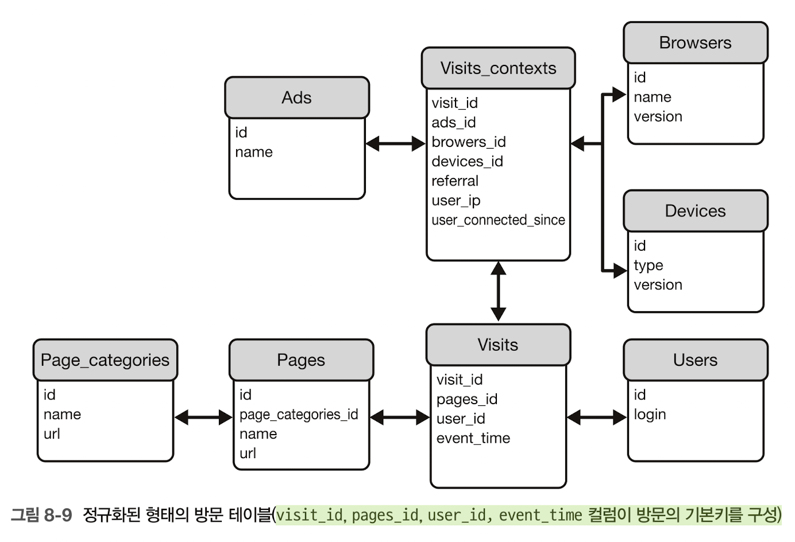
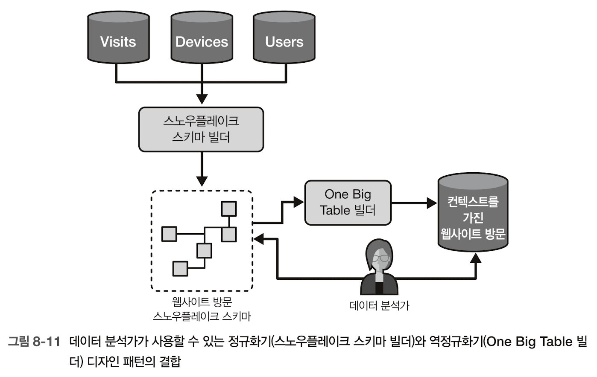
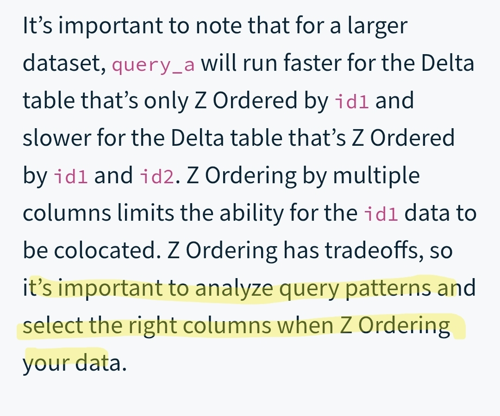
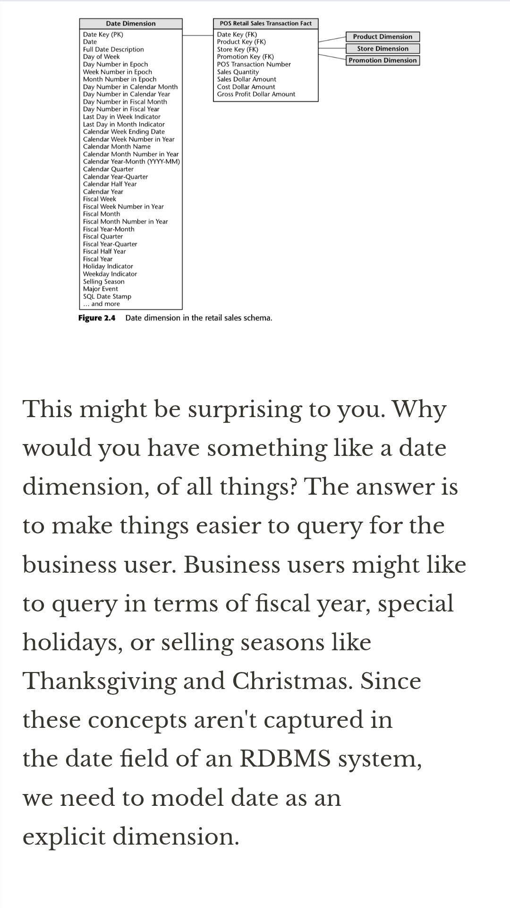

# Ch8. Data Storage Design Patterns
## concept

### 파티셔닝 (낮은 카디널리티): 레이아웃 정의-접근-최선의 방법

- 수평 파티셔너: 가장 일반적으로 사용됨
    - [Problem] 특정 기간의 롤링집계 계산 배치잡
        
        → 데이터량 증가, 작업성능 저하(원인: 이전 기간 레코드 필터링 작업의 실행시간이 주요인)
        → 일시적 해결책: 컴퓨팅파워 증가; 비용 역시 증가 
        ⇒ 비용을 증가시키지 않는 해결책이 필요
        
    - [Solution] 증분 데이터 처리의 예
        - 파티셔닝 속성(분산 키) 식별 → 시간 기반(속성: 잡 실행 컨텍스트→작업 실행 시간, 데이터셋→이벤트 시간), 비즈니스 키(고객ID, 파트너ID, 고객의 지리적 지역 등), 중첩 파티셔닝(시간기반+비즈니스 키 기반)
        - 설정방법: 선언적 방식 vs 데이터 프로듀서
            - 선언적 방식: 데이터 브릭스, GCP 빅쿼리-`CREATE TABLE ... PARTITIONED BY`
            - 데이터 프로듀서(위임?): 아파치 스파크-`partitionBy` , 아파치 카프카-`자체 파티셔너 클래스 생성`
            - 파티션 메타데이터 관리 (data store)
                - GCP 빅쿼리: `INFORMATION_SCHEMA.PARTITIONS` 뷰
                - 데이터브릭스: `DESCRIBE TABLE EXTENDED` 명령 출력 일부
                - 아파치 아이스버그: `SELECT * FROM a_catalog.a_namespace.a_table.partitions` 뷰
    - [Consequence] 단점=정적 특성
        - 세분화, 메타데이터 오버헤드; 낮은 카디널리티 속성을 사용
        - 스큐: 지연문제의 원인; 백프레셔 매커니즘..(별도 버퍼, 다음 마이크로배치에서 처리, 스큐된 파티션 전달지연o)
        - 가변성: 변경 어려움; 데이터 스토어의 개별 지원(아파치 아이스버그; 메타데이터 계층에서만)
    - [ex]
        - 아파치 스파크: `partitionBy(컬럼명,)` 메서드
        - 아파치 카프카: 사용자 정의 파티셔너로 로직 구현(java-Partitioner인터페이스 구현)
        - PostgreSQL: `CREATE TABLE ~~ (...) PARTITION BY RANGE(컬럼명)` / `CREATE TABLE ~~~ PARTITION OF ~~`
- 수직 파티셔너
    - [Problem] 방문기록; 가변속성과 불변속성 → 불변속성의 중복 피하기
    - [Solution] 두 유형의 속성⇒수직 파티셔너 적용
        1. 데이터 분류
            - 관련 속성→그룹화
            - 식별 속성→이들의 결합에 사용됨
        2. 데이터 처리
            - 각 레코드에 대해 그룹화된 속성→전용 위치에 write
        - 장점: 저장비용 최적화, 유연성(데이터 보존, 데이터 접근 정책 적용)
    - [Consequence]
        - 도메인 분할: 논리적 관련 속성의 물리적 분할; 양질의 문서화 지원 필요
        - 쿼리: 전체 그림 파악 어려움; 결합하는 View(→데이터셋 구체화기 패턴)
        - 데이터 프로듀서: 레코드를 그대로 가져와 쓰기X, 네트워크 통신 비용⬆
    - [ex]
        - 아파치 스파크: persist() → drop()/select()
        - PostgreSQL: `INSERT INTO … SELECT FROM` 작업/ `CREATE TABLE AS SELECT` 구조

### 레코드 구성 (높은 카디널리티)

- 버킷 (colocation)
    - [Problem] 높은 카디널리티 컬럼을 파티셔닝 컬럼으로 사용하고 싶음
    - [Solution] 전용위치에 저장; 동일한 저장영역에 다른값들을 코로케이션
        - 버킷팅에 사용할 컬럼을 정의 → 생성하려는 버킷 수 설정(~카디널리티, ~=모듈러 해싱)
        - 효과: 최적화 기법—버킷 프루닝, 네트워크 교환(셔플)제거
            
            <aside>
            💡
            
            분산 집계기 패턴→네트워크 교환
            
            </aside>
            
    - [Consequence] 정적인 데이터가 문제가 됨
        - 가변성: 버킷팅 스키마는 불변
        - 버킷크기: 적절한 크기 찾기가 어려움(현재 볼륨? 숫자 예측?)
    - [ex]
        - aws 아테나: 논리적 수준에서 버킷 패턴 구현(서버리스 쿼리서비스) `CLUSTERED BY(컬럼명), TBLPROPERTIES('bucketing_format'=버킷팅형식)` ,
        - 아파치 스파크: `bucketBy()` 로 버킷형 테이블 생성
- 정렬기 (데이터 저장순서)
    - [Problem] 쿼리 실행시간(데이터 접근 지연) 가속화 (조건: 사용자 쿼리 유형 정보o)
    - [Solution] 정렬 컬럼 식별→생성쿼리:정렬 컬럼 선언→DB:정의된 순서에 따라 구성
        - 정렬 컬럼을 대상으로 하는 모든 쿼리→관련된 메타데이터 정보 활용→관련 없는 데이터 블록 skip 가능
        - 곡선 정렬: Z-order(vs 사전식 정렬) —델타 레이크, 아파치 아이스버그, 아마존 레드시프트(인터리브된 정렬 키 기능)
    - [Consequence]
        - 정렬되지 않은 세그먼트: 정렬작업의 시간차; 쓰기 작업 내부or외부에서 정렬 작업 예약 필요(→실행시간 영향o..)
        - 복합 정렬 키: 사전식 순서로 복합 정렬인 경우→대상 컬럼보다 복합 정렬 상 앞서있는 컬럼을 참조해야함.
        - 가변성: 정렬 키 변경 시 전체테이블 정렬이 필요..
    - [ex]
        - GCP 빅쿼리: 클러스터된 테이블(`CLUSTER BY` )
        - 델타레이크: Z-order 컴팩션(`.optimize().executeZOrderBy(['visit_id','page'])` )

### 조회성능 최적화

- 메타데이터 강화기(불필요한 데이터 관련 작업 피하기)
    - [Problem] 데이터분석가→동일한 파티션된 데이터셋→쿼리 실행 지연&클라우드 요금 증가 (적재 후 필터링로직 ⇒ 역순으로..)
    - [Solution] 적재 전 관련없는 데이터파일 건너뛰기
        - 파일/db에 저장된 레코드에 대한 통계 수집 및 유지
            - 파일: 컬럼형 파일 형식 — 각 데이터 파일이 추가 메타데이터가 있는 푸터를 포함 (아파치 파케이/커밋로그)
            - db: RDBMS, 데이터 웨어하우스의 테이블의 통계
    - [Consequence]
        - 오버헤드: 쓰기 시점에 통계 구축&유지
        - 오래된 통계: 자동갱신o 갱신프로세스 지연o(임계값에 의해 실행 제어→임계값 내의 작은 변경→낙후 가능성); 수동 새로고침( `ANALYZE TABLE` )
    - [ex]
        - 아파치 파케이: `.write.mode('overwrite').parquet(path=get_parquet_dir())`
        - 델타레이크: 파케이 메타데이터 위에 추가계층(in 커밋로그), 내부적인 수행
- 데이터셋 구체화기(비용이 많이 드는 작업은 한번만 실행—후속 reader들을 위해 구체화)
    - [Problem] 동일 데이터셋의 여러 파티션된 테이블 쿼리 프로세스를 단순화 ⇒ 뷰 생성; 성능 문제o ⇒ 단일 데이터 접근지점 제공 필요.
    - [Solution] 결과 계산이 느림 ⇒ 데이터를 구체화하여 문제를 피하기
        - 구체화되어야 하는 데이터셋 식별 → 구체화 구현(SELECT-UNION/JOIN) ⇒ (데이터베이스에서 구체화된 뷰) or (테이블)
            - 구체화된 뷰(o) vs 테이블(x): 자동새로고침
    - [Consequence]
        - 새로 고침 비용: 생성쿼리 재실행; 증분 새로고침
        - 데이터 접근: 일관된 데이터 관리 적용이 어려움(보존,접근구성 등)
        - 데이터 스토리지 오버헤드: 저장소;데이터셋 구체화기 패턴의 혼합구현(일부만 구체화)
    - [ex]
        - GCP 빅쿼리(자동 새로고침)
        - PostgreSQL(수동 새로고침)
        - 데이터셋 구체화기 패턴의 증분버전(특정 컬럼을 사용하여 이전 실행 후에 추가된 레코드만 쿼리, 결과를 기존 데이터셋과 결합)
- 매니페스트(비용 많이 드는 작업을 피하여 데이터 준비단계 단순화)
    - [Problem] 데이터 웨어하우스 계층 만들기→데이터셋 노출→실행시간⬆(=객체 스토어에서 적재할 파일을 목록화하는 단계⇒피하기)
    - [Solution] 파일을 1번/0번(미리 프로듀서가 파일명 기록o) 목록화
        - 자동 생성 매니페스트: 테이블 파일 형식(델타 레이크, 아이스버그, 후디)—주어진 트랜잭션 내 생성된 파일목록을 커밋로그(=메타데이터 위치에 저장된→매니페스트 파일 역할)에 write
        - 수동 생성 매니페스트: 팬아웃(6장) 패턴 일부
        - 데이터 쓰기 에서도 중요한 역할: 레드시프트(COPY 명령어→로딩작업 별/매니페스트 파일 사용), GCP(storage transfer service)
    - [Consequence]
        - 복잡성: 실행 플로가 약간 복잡
        - 크기: 입력위치에 많은 작은 파일o OR 데이터 프로듀서가 연속 스트리밍 작업; 매니페스트 파일의 최대 크기 제한/파일에 있는 항목에 대한 보존
    - [ex]
        - gcp 빅쿼리: 델타 레이크 데이터셋에 대한 외부 테이블 생성(매니페스트 파일생성→외부 테이블 생성문으로 이 파일 참조)
        - aws 레드시프트: 테이블에 로드할 파일목록과 함께 COPY명령의 멱등성 강제(로드 전 매니페스트 생성 후 작업실행과 연결)

### 데이터 표현

- 정규화기 (데이터 일관성 선호)
    - [Problem] 불변속성(vs이벤트 기반 속성)들이 각 방문 레코드마다 반복되어 저장공간 증가, 수정될때마다 갱신 연산이 느려짐
    - [Solution]
        - 설계 프로세스: 비즈니스 엔티티 정의→설명(속성)→관계 정의(의존성)
            - 정규형(NF): 제1정규형(원자적 값), 제2정규형(컬럼-기본키의존), 제3정규형(기본키가 아닌 컬럼-기본키 의존)
                - 트랜잭션 워크로드에 널리 사용 / 분석 워크로드(차원 모델=팩트 테이블+차원 테이블)
            - 스노우플레이크 스키마: 차원모델 중 하나, 차원 테이블의 하위 차원o(여러번 반복되는 속성→하위 차원 테이블로 이동시키는 경향)
    - [Consequence]
        - 쿼리 비용: 데이터를 여러곳에 분할→쿼리 시 JOIN연산 의존(분산 환경에서 네트워크를 통해 데이터 교환작업o); 네트워크 트래픽을 줄일 수 있는 방법(작은 차원/엔티티 테이블을 큰 테이블과 함께 배치 or 브로드캐스트 모드)
        - 아카이브: 시간에 민감할 수 있음; SCD기법(5장 정적 조이너 패턴)
    - [ex]
        
        
        
        - 정규화된 데이터셋 조인 → 쿼리 오버헤드o
        - 스노우플레이크 → 코드는 단순화; 쿼리 오버헤드o
- 역정규화기 (실행시간⬇️; 일관성 절충)
    - [Problem] 쿼리 실행 시간 단축을 위한 해결책→쿼리의 80%에 관련된 8개 테이블을 모두 조인→역정규화기
    - [Solution] 제거 접근법: 모든 테이블의 값을 단일 레코드로 평면화, 네트워크를 통해 데이터 교환이 불필요하게
        - One Big Table(일반적인 컬럼처럼, join된 테이블의 컬럼을 그대로 복사)
        - 중첩된 구조(join된 테이블의 모든 레코드를 목적 테이블의 하나의 컬럼에 담기): 스타 스키마 차원 모델 등
        - 정규화기와 배타적X: 시퀀스 디자인 패턴(6장)을 활용
            
            
            
    - [Consequence]
        - 고비용 갱신: 모든 속성이 중복→갱신 비용이 큼; 역정규화된 테이블을 무엇으로 간주하느냐에 따라 완화 가능(ex. 스냅샷 등)
        - 스토리지: 데이터베이스 상 공간차지; 인코딩 기법(딕셔너리 사용: 긴 문자열 컬럼→정수로 변환)
        - 하나의 큰 안티패턴: one big table→도메인 지향적 로직을 따르도록..
    - [ex]
        - One Big Table: 생성비용⬆ 갱신연산비용⬇️
        - 스타 스키마: 쓰기 단계에서 더 많은 테이블 생성

# key takeaway/deep dive

### 코드 비교 이해..(정규화기 vs 역정규화기)

- 정규화기

```python
context = (visits_context    
		.join(ads, visits_context.ads_id == ads.id, 'left_outer').drop('id')    
		.join(browser, visits_context.browsers_id == browser.id, 'left_outer').drop('id')    
		.join(device, visits_context.devices_id == device.id, 'left_outer').drop('id'))

page_with_category = (pages.withColumnRenamed('id', 'page_id')    
		.join(categories, pages.page_categories_id == categories.id, 'left_outer')    
		.drop('id').withColumnRenamed('page_id', 'id'))

full_visit = (visits    
		.join(context, visits.visit_id_event == context.visit_id, 'left_outer')    
		.drop('visit_id_event')    
		.join(users, visits.users_id == users.id, 'left_outer').drop('id')    
		.join(page_with_category, visits.pages_id == page_with_category.id, 'left_outer')    
		.drop('id').withColumnRenamed('visit_id', 'id')
)
```

- 역정규화기-one big table

```python
# writing
page_w_category = dim_page.join(dim_page_category,    
		dim_page.dim_page_category_id == dim_page_category.page_category_id,        
				'left_outer')

date_w_month_quarter = (dim_date    
		.join(dim_date_month, dim_date.dim_month_id == dim_date_month.month_id,        
				'left_outer')    
		.join(dim_date_quarter, dim_date.dim_quarter_id == dim_date_quarter.quarter_id,        
				'left_outer'))

full_visit = (fact_visit    
		.join(page_w_category, fact_visit.dim_page_id == page_w_category.page_id,    
				'left_outer')    
		.join(date_w_month_quarter, fact_visit.dim_date_id == date_w_month_quarter.date_id,    
				'left_outer')
)

full_visit.write.mode('overwrite').format('delta').save(get_one_big_table_dir())

# reading
visits_table = spark_session.read.format('delta').load(get_one_big_table_dir())

```

- 역정규화기-스타 스키마

```python
# writing
page_with_category = dim_page.join(dim_page_category,    
		dim_page.dim_page_category_id == dim_page_category.page_category_id,    
				'left_outer').dropDuplicates()
page_with_category.write.mode('overwrite').format('delta').save(output_page)

date_with_month_and_quarter = (dim_date   
		.join(dim_date_month, dim_date.dim_month_id == dim_date_month.month_id,'left_outer')    
		.join(dim_date_quarter, dim_date.dim_quarter_id == dim_date_quarter.quarter_id,'left_outer')).dropDuplicates()
(date_with_month_and_quarter.write.mode('overwrite').format('delta')
		.save(output_date_dir))

visits_dataset = (spark_session.read    
		.schema('visit_id STRING, event_time TIMESTAMP, page STRING')    
		.format('json').load(input_visits_dir))
fact_visit = (visits_dataset.selectExpr(    
		'visit_id', 'HASH(page) AS dim_page_id',    
		'HASH(TO_DATE(event_time)) AS dim_date_id',    
		'DATE_FORMAT(event_time, "HH:mm:ss") AS event_time')
)
fact_visit.write.mode('overwrite').format('delta').save(output_visits_dir)

# reading
fact_visit = spark_session.read.format('delta').load(output_visits_dir)
dim_date = spark_session.read.format('delta').load(output_date_dir)
dim_page = spark_session.read.format('delta').load(output_page_dir)

full_visit = (fact_visit    
		.join(dim_date, fact_visit.dim_date_id == dim_date.date_id, 'left_outer')    
		.join(dim_page, [fact_visit.dim_page_id == dim_page.page_id], 'left_outer'))

```

### 정렬기: data skipping을 강하게 만드는 정렬

핵심은 정렬이 단순 배치가 아니라, **파일/row group의 min-max 범위를 좁혀서 더 많이 건너뛰게 만드는 구조**. 

https://delta.io/blog/2023-06-03-delta-lake-z-order/

- 어떤 컬럼을 정렬/클러스터링 대상으로 잡아야 하는지까지 포함해 설명.
    - 북마크
        - with Hive-style partitioning.
        Z Ordering vs. partitioning data.(후속)
        - 컬럼 선택 관련
            
            
            
- databricks-data skipping 자료
    
    https://docs.databricks.com/aws/en/delta/data-skipping
    
    - Databricks는 data skipping과 Z-order를 연결해서 설명.

---

### 역정규화기 (star schema)

정규화기는 현대 데이터 레이크 문맥보다 OLTP/모델링 이론 쪽 성격이 강해서, 지금 찾는 스타일과는 약간 결이 다름. 대신 역정규화기와 star schema/OBT 비교 쪽이 더 흥미로울 가능성이 높다.

https://www.holistics.io/books/setup-analytics/kimball-s-dimensional-data-modeling/

- 현대 columnar/nested 계열과 대비해서 star schema 감각을 잡는 데 좋습니다
    - Bookmark
        
        