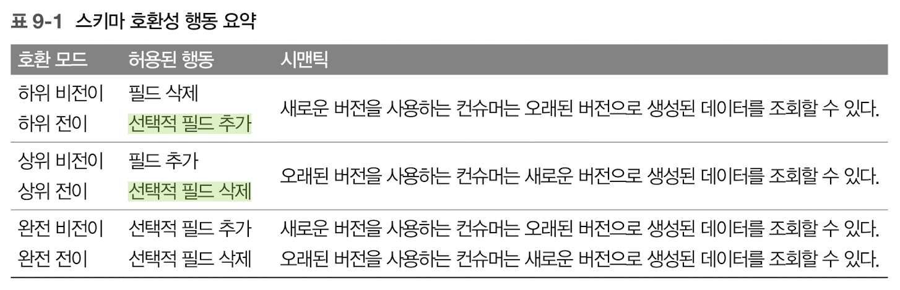
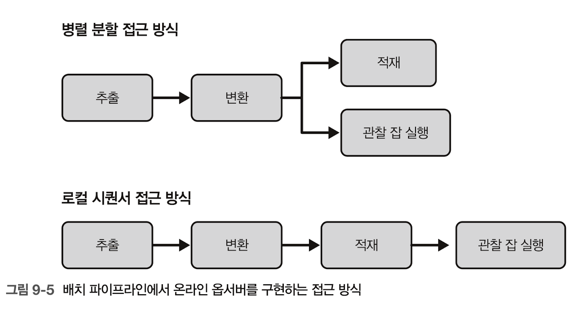
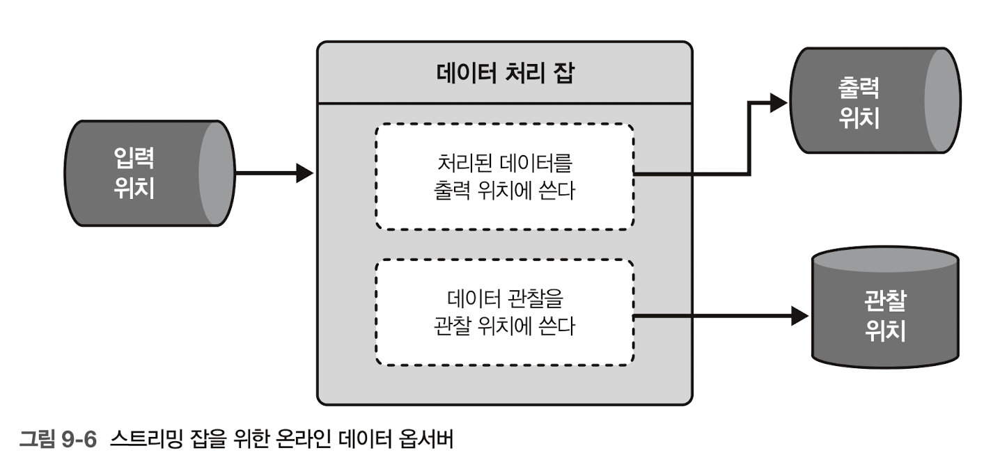

# concept

## 품질 확보 (데이터 수준, 노출x)

### 감사-쓰기-감사-배포(AWAP): 데이터 흐름에 제어추가(~=assertion)

- [Problem] 고유 방문자 집계가 올바르게 계산되지 않음(50% 감소했다는 결과)을 추후에 발견
- [Solution]
    - 감사단계(완전성or정확성 같은 비즈니스/기술적 요구사항 충족)를 추가
        - 1st Audit job: 데이터셋 변환 전에 입력 데이터 원천을 분석(유효성확인) ⇒ 빠르게 처리되는 작업만(ex. 형식 검증, 크기 관리, 스키마 점검)
        - 2nd Audit job: 변환된 데이터 유효성 확인 ⇒ 데이터에 집중한 제어함수(ex. 유효성 확인 함수)
            - 주의: 유효성 확인 함수의 중복(단계에 따라 목적/범위가 다름, 중복처리 비용o)
    - 유효성 확인
        - 범위: 레코드 수준(속성) / 데이터 수준(크기, unique, null비율)
        - 결과: 데이터 디스패칭(유효한 부분만 승격) / 비차단 감사(약간의 결함→주석표시 후 승격)
    - 스트리밍(vs 배치): 1st audit job이 누락
        - 윈도 기반: 스트리밍잡에서..(감사함수)
        - 스테이징 기반: 최종출력위치로 승격 전..(감사job)
- [Consequence]
    - 비용 계산: 메타데이터 기반 작업(1st)은 저렴; 데이터 작업(2nd)은 비쌈
    - 규칙 적용 범위: 레코드값 검증 시 비즈니스 규칙 세트 정의가 필요→시간에 따른 변화o→100%신뢰X
    - 스트리밍 지연: 스트리밍→추가 지연o
    - 문제는 문제가 아닐 수 있다: 제1종오류?
- [ex]
    - SQL기반 검증: **`audit_file_to_load`** >> `transform_file` >> **`audit_transformed_file`** >> `load_flattened_visits_to_final_table`
        - **`audit_file_to_load`**의 입력데이터셋 유효성 확인: f_size, lines, invalid_json_line 등 체크
        - **`audit_transformed_file`** 의 데이터 유효성 확인: null값 찾기(pandas)
    - 아파치 스파크의 구조적 스트리밍 예제: 트리거 사용 / 스테이징 테이블 스트리밍→데이터 품질 제어

### 제약 조건 적용자(enforcer): db/스토리지 형식에 품질관리업무를 위임(선언적 접근방식)

- [Problem] 데이터 처리에서 유효성 확인을 하지 않고 데이터 품질 오류(필수필드 등) 시 로딩 프로세스를 실패하게 할 대안이 필요함
- [Solution] 유효성 확인에 대한 책임을 DB에 위임
    - (how to) 제약규칙이 할당될 속성 식별 → 제약조건 할당(유형 제약 / NULL허용 제약 / 값 제약 / 무결성 제약)
    - consumer: 데이터셋 형태&가능한 값을 정의 ⇒ 정보제공
    producer: 유효성 확인 제어를 통과하지 못한 레코드 추가를 방지
- [Consequence]
    - all-or-nothing 시맨틱: 유효성 규칙 미준수→어떤 레코드도 받아들이지 않음. 첫번째 발견 오류에서 멈춤 ⇒ 모든 문제을 발견하려면 번거로워짐.
    - 데이터 프로듀서 교대: 프로듀서 친화적; 서로 다른 컨슈머는 데이터 기대치가 다름. ⇒ 컨슈머가 이미 제한된 데이터셋에 대해 여전히 데이터 유효성 확인/데이터 필터링 로직 구현이 필요할 수 있음.
    - 제약조건 지원: 모든 유효성 규칙을 지원하지 않을 수 있음.(특히 테이블 파일 형식→무결성 제약 조건 지원x)
- [ex]
    - 델타 레이크(테이블 파일 형식)
        - 유형 제약 조건, 널 허용 제약조건, 값 제약 조건
        - 위반 시, `DELTA_VIOLATE_CONSTRAINT_WITH_VALUES` or `DELTA_NOT_NULL_CONSTRAINT_VIOLATED`
    - Protobuf(직렬화 파일 형식)
        - 유형 제약 조건→라이브러리, 값 제약 조건→protovalidate 설치

## 스키마 일관성 (스키마 수준 제어)

### 스키마 호환성 적용자(enforcer)

- [Problem] 스키마를 손상시키는 변경을 피할 방책을 구축해야함.
- [Solution]
    - 데이터 스토어에 따라 가용한 세가지 스키마 호환성 적용 모드
        1. 외부 서비스/라이브러리: 아파치 카프카—스키마 레지스트리(프로듀서와 컨슈머가 소통하는 api 노출시 적용하는 모드), 아파치 Avro(SchemaValidator 클래스; 호환성 규칙 설정은 불가능)
        2. 삽입 시 암시적: 테  이블 파일 형식 or 관계형 데이터베이스에 적용(제약조건 정의); 명시적 스키마 호환모드 정의 불가
        3. 데이터 정의 언어(DDL)에 대한 이벤트 주도: 일부 관계형 데이터베이스의 DDL 작업을 커밋전에 추가 가능한 이벤트 트리거(스키마 적용 규칙 포함o, 미호환 시 작업 롤백/ 세밀한 제어가 불필요한 경우 ALTER TABLE 권한을 미부여)
    - 스키마 호환성 모드 종류
        
        
        
        비전이vs전이→선택적 / (완전)비전이vs전이→추가만 허용하냐 삭제만 허용하냐? 근데 완전 전이에선 선택적 필드추가&삭제가 둘다 되야하는거 아닌가?
        
        1. 하위 호환성: 새로운 스키마를 사용하는 컨슈머가 오래된 스키마로 생성된 데이터를 여전히 조회 가능.
            
            ex. 새로운 스키마에 새로운 선택적 필드O→추가된 필드는 오래된 스키마로 생성된 레코드에 존재X
            
        2. 상위 호환성: 오래된 스키마를 가진 컨슈머가 새로운 스키마로 생성된 데이터를 조회 가능.
            
            ex. 오래된 스키마에 있는 선택적 필드가 새로운 스키마에서 삭제→스키마로 생성된 레코드에는 삭제된 선택적 필드가 없음→비어있음; 필드는 선택사항
            
        3. 완전 호환성: 이전 스키마(새로운 스키마)로 생성된 데이터가 새로운 스키마(이전 스키마)가 조회/접근 가능
- [Consequence]
    - 상호작용 오버헤드: 특히 외부 스키마 레지스트리 컴포넌트를 통하면 생성에 오버헤드O
    - 스키마 진화: 스키마 변경이 복잡해짐(데이터셋에 정의된 스키마 호환성 수준을 고려)
- [ex]
    - 아파치 카프카 (스키마 레지스트리): 스키마 정의(호환성 모드 포함)→스키마 호환성 오류 메시지
    - 델타 레이크: 암시적 적용, 초기 스키마 작성→미호환되는 컬럼 추가 시 예외로 응답

### 스키마 마이그레이터

> 필드 유형 진화or이름 변경 같은 호환성을 깨는 스키마 변경 수행 가능 + 컨슈머를 안전하게 유지하는 방법??
> 
- [Problem] 호환성을 유지하면서(기존 스키마를 근본적으로 변경x) + 컨슈머에게 새로운 형식(관련 속성을 동일한 엔티티로 그룹화, 개편)으로 마이그레이션할 시간을 주어야함.
- [Solution]
    - 스키마 호환성 적용자 패턴은 변경 가능한 유형만 제어
        - → 스키마 마이그레이터 패턴(스키마 호환성이 비전이적일 것을 요구)
    - [how to impl?] 진화를 식별하기
        1. 이름 변경: 특정 속성 이름이 잘못됨or난해
        2. 유형 변경: 스키마를 체계적으로 정리~처리 효율을 높이기 위한 최적화
        3. 제거: 제거하려는 속성을 처리하는 다운스트림 컨슈머가 전혀 없다는 것을 100%보장 OR 대체할 것을 찾기/취소
        - 1,2의 경우 ⇒ 새 필드 생성→컨슈머와 전환 시간 **합의**→그 동안 이전 속성&새로운 속성을 동시에 받음→마감일에 도달 후에만 새로운 속성만 포함된 스키마의 새버전을 받음
- [Consequence]
    - 크기 영향: 마이그레이션 수행을 위한 safety 매커니즘 제공 시 ⇒ 저장공간, 네트워크 전송, I/O 형태의 비용 발생 + 메타데이터/통계 계층에 영향O
    - 불가능한 제거: 필드 제거 시나리오에서 제한됨(컨슈머가 사용 중인 필드→대체 속성을 제공해야만 제거가능)
- [ex] 다양한 기술에 대해 스키마 마이그레이션 워크플로가 동일
    - → 하나의 데이터 형식에 집중, 스키마 마이그레이션이 위 패턴을 따르지 않는 경우 발생하는 시나리오
        1. (컨슈머가 연결된 컬럼을) 전용 테이블로 추출
        2. 컬럼 이름 변경 작업을 직접 수행(ALTER~RENAME COLUMN문)? X
        3. 새 컬럼을 생성하여 이름 변경을 마이크레이션(ALTER~ADD COLUMN문)
        
        이후는???? + 컨슈머가 워크로드를 조절해야만 이전 컬럼을 제거할 수 있다.???
        

## 품질 관찰 (제어x 관찰o)

### 오프라인 옵서버: 별개의 관찰 컴포넌트로 존재; 처리 워크플로에 관여X

- [Problem] 데이터셋의 완전한 정형화+품질 보장 ⇒ 업스트림 데이터셋이 앞으로 몇달안에 진화할 것이라고 예상 ⇒ 데이터셋의 속성을 모니터링; 이 계층이 메인 파이프라인을 차단하지 않아야함.
- [Solution] 처리된 레코드 분석 → 추가적 인사이트(값의 분산, nullable 필드 상 null의 개수, 처리되지 않은 new 필드 등)로 기존 모니터링 계층을 강화하는 데이터 관찰가능성 잡 생성
    - 독립적 실행, 완전 다른 스케줄로 실행 가능
- [Consequence]
    - 시간 정확도: 적시에 실행되지 않을 수 있음. (인사이트가 도출되기 전에 문제 데이터셋을 처리)
    - 컴퓨팅 자원: 데이터 생성 잡보다 빈도를 낮춰 스케줄러에 등록(관찰을 위한 하위집합 추출→배치처리에 따른 컴퓨팅자원, 흥미로운 관찰을 놓칠 수 있음)
- [ex]
    - 배치 수집 파이프라인(아파치 에어플로)
        - `wait_for_new_data >>` 
        `record_new_observation_state >>` (데이터 관찰 상태기록 쿼리)
        `insert_new_observations` (데이터 관찰 쿼리)
    - 스트리밍 파이프라인(아파치 스파크)
        - `query = (
        visits_to_observe.writeStream.foreachBatch(generate_and_write_observations)
        .option('checkpointLocation', checkpoint_location).start()
        )`
            - 관찰로직: `generate_and_write_observations`
        - 이후 처리된 데이터셋에 대한 프로파일링(HTML, ydata-profiling라이브러리)
        - + 지연감지 함수: 체크포인트 위치에서 (데이터 생성잡이 가장 최근에 커밋한) 오프셋을 (입력 토픽에 존재하는 가장 최근의) 오프셋과 비교

### 온라인 옵서버(지연 해결→실시간에 가까움)

- [Problem] 오프라인 옵서버가 문제를 발견했지만 배치 시간 처리로 인해 지연발생, 사용자들이 먼저 문제를 발견함. ⇒ 컨슈머가 데이터 품질 문제를 발견하기 전에, 문제를 발견하고 해결해야함.
- [Solution]
    - (배치 파이프라인) 관찰 지표를 생성하기 위해 데이터 관찰잡에 의존; 실행시간에의 차이(데이터 생성 파이프라인의 내부에 위치)
        - 관찰 잡을 어디에?: 일반적으로는 변환 단계 이후(→병렬 분할 패턴or로컬 시퀀서 패턴에 적용o)
        
        
        
    - (스트리밍 파이프라인) 관찰로직을 데이터 생성 잡에 통합(별개의 파이프라인으로 실행 불가)→예상치 못한 오류/메모리 문제 발생 시 전체 잡에 영향; 데이터셋을 샘플링하여 줄일 수 있음(일부 인사이트를 놓칠 수 있음)
        
        
        
- [Consequence]
    - 추가 지연: 로컬 시퀀서 패턴에 활용한다면 ⇒ 파이프라인의 완료를 지연&비용o
    - 병렬 분할: 병렬 분할 패턴에 활용한다면 ⇒ 부분적으로만 유효한 데이터셋을 관찰하는 위험o(ex. 날짜 시간 속성)
    ⇒ 로컬 시퀀서 접근 방식; 관찰은 load가 아닌 transform에 초점.
- [ex]
    - 오프라인 옵서버 패턴과 동일; 오프라인 관찰 코드⇒온라인 코드로 변환(반응성 ⬆)
        - 아파치 에어플로 (배치 파이프라인): all_done으로 트리거 규칙을 설정, 관찰 실패의 경우에도 파이프라인 성공 표시
        - (스트리밍 파이프라인):
            - 지연 감지: 검색된 레코드에 대해 (partition, offset) 추가 컬럼을 포함→이를 사용하여 마이크로 배치에서 가장 최근에 처리한 레코드를 가져옴
            - 누산기: ↔ 복잡한 SQL 쿼리(잘못된 레코드개수, 파티션당 최대 오프셋을 모두 생성), accumulators(아파치 스파크 전용 컴포넌트, value()가 호출되지 않는 한 각 실행자에서 로컬로 실행)

# Key takeaway | Deep dive

https://docs.confluent.io/platform/current/schema-registry/fundamentals/schema-evolution.html

- Avro, Protobuf, JSON Schema → 각 기술에 대한 추가 링크
- backward, forward, full & transitive compatibility를 체계적으로 설명.
    - BW/FW/full과 BW/FW/full transitive의 구분O
- 특히 Kafka 쪽에서는 왜 backward compatibility가 기본으로 선호되는지.

- (yet..)
    
    https://softwaremill.com/schema-evolution-protobuf-scalapb-fs2grpc/
    
    producer-first냐 consumer-first냐에 따라 forward/backward compatibility 요구가 달라짐